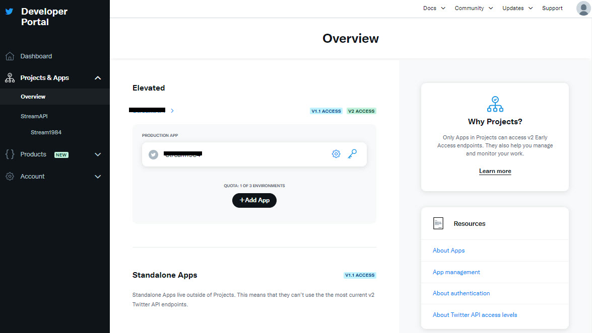
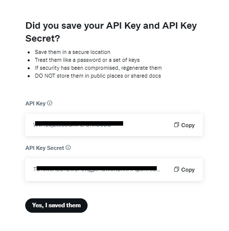

# TwitterAPI

This TwitterAPI solution for self-education/training is a Proof of Concept of how to combine different .NET technologies (Azure, .NET 6, Worker Service, API, Event Bus, Web App, SQL Database...) for processing transactions concurrently within a high-volume transaction environment.

It is also meant to illustrate how to follow good development patterns such as:
* SOLID
  * Single-Responsibility Principle
  * Open-Closed Principle
  * Liskov Substitution Principle
  * Interface Segregation Principle
  * Dependency Inversion Principle
* Use of patterns that could scale applications and are loosely coupled to external systems
* Good use of error handling, logging, and unit testing

The solution uses the Twitter API which provides a sampled stream endpoint that delivers a roughly 1% random sample of publicly available Tweets in real-time.
The Twitter API v2 sampled stream endpoint provides a random sample of approximately 1% of the full tweet stream that can be used for social sentiment analysis.

This solution consumes the sample stream and keep track of the following:  
• Total number of tweets received  
• Top 10 Hashtags 


#### High-Level Architecture diagram for the solution.


## Requirements
* You will need a Twitter Developer Account
* Within your Twitter Developer Account you need to create a Project with an Application inside



* Copy API Key and API Secret



* Replace the values on the appsettings.json of the downloaded project **TwitterAPI.DataPullingService**
```
  "TwitterAPISettings": {
    "ApiKey": "B0Pkt9jYspkK6sM54QNaUyLjv",
    "ApiSecretKey": "8kZu9rEkRx8K3ajwlvyAX1YicEbYbL3Rl1ekw8dvNijSv3CcK1"
  }
```
* Run with multiple startup projects **TwitterAPI.DataPullingService** and **TwitterAPI.WebAPI**
* Use the api endpoint **Tweet/GetAggregatedStatistics** from **TwitterAPI.WebAPI** project to calculate, retrieve and view the Aggregated Statistics
```
curl -X 'GET' \
  'https://localhost:44313/Tweet/GetAggregatedStatistics' \
  -H 'accept: text/plain'
```  
It will return the following Json object:
```
{
  "id": 7,
  "aggregationGuid": "67298808-a691-498e-a4af-b3a02cea463d",
  "numberOfTweets": 90467,
  "upToDate": "2022-10-07T16:51:11.95+00:00",
  "top10Hashtags": [
    {
      "id": 61,
      "hashtag": "#مهسا_امینی",
      "hashtagCount": 8241,
      "tweetAggregatedStatisticId": 7
    },
    {
      "id": 62,
      "hashtag": "#نیکا_شاکرمی",
      "hashtagCount": 3296,
      "tweetAggregatedStatisticId": 7
    },
    {
      "id": 63,
      "hashtag": "#çerkezköy",
      "hashtagCount": 2378,
      "tweetAggregatedStatisticId": 7
    },
    {
      "id": 64,
      "hashtag": "#kapaklı",
      "hashtagCount": 2291,
      "tweetAggregatedStatisticId": 7
    },
    {
      "id": 65,
      "hashtag": "#지구에서년지성아환영해",
      "hashtagCount": 2210,
      "tweetAggregatedStatisticId": 7
    },
    {
      "id": 66,
      "hashtag": "#bornova",
      "hashtagCount": 1294,
      "tweetAggregatedStatisticId": 7
    },
    {
      "id": 67,
      "hashtag": "#buca",
      "hashtagCount": 1286,
      "tweetAggregatedStatisticId": 7
    },
    {
      "id": 68,
      "hashtag": "#กราดยิงหนองบัวลําภู",
      "hashtagCount": 1206,
      "tweetAggregatedStatisticId": 7
    },
    {
      "id": 69,
      "hashtag": "#OpIran",
      "hashtagCount": 1201,
      "tweetAggregatedStatisticId": 7
    },
    {
      "id": 70,
      "hashtag": "#karşıyaka",
      "hashtagCount": 1160,
      "tweetAggregatedStatisticId": 7
    }
  ]
}
```

## New Features Added 10/06/2022
* Save tweets in database via existing API until Processing Queue is implemented
* Refator databases Tweet Model to support multiple hashtags
* Modify data aggregation scripts to work with multiple hashtags per tweet

## Upcoming Features
* Pull aggregated data and display it on TwitterAPI.WebApp
* Automatically push data into the TwitterAPI.WebApp using SignalR
* Create Processing Queue using Azure Service Bus
* Implement Azure Key Vault for storing Twitter API Keys
* Implement UI Dashboard using Blazor
* Implement CRUD UI using Blazor to feed data store with manual Tweets


