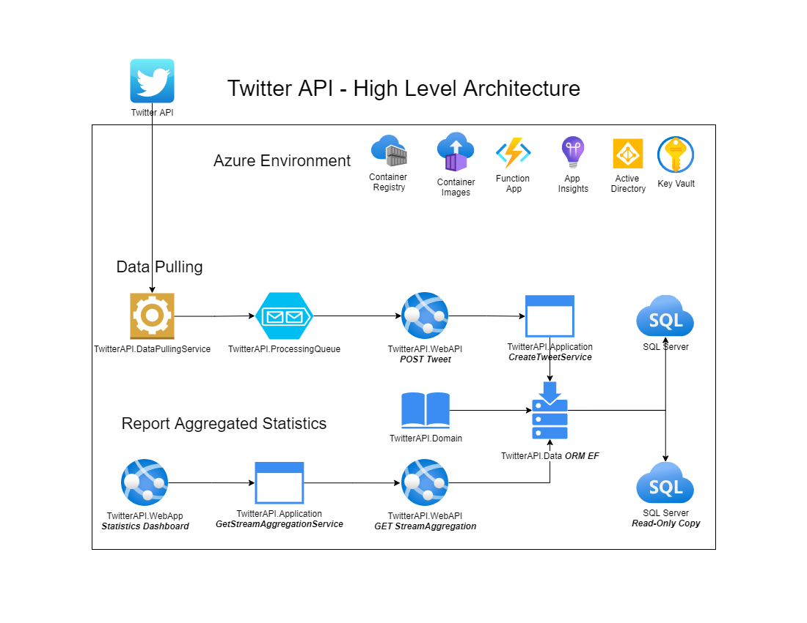

# TwitterAPI

The Twitter API provides a stream endpoint that delivers a roughly 1% random sample of publicly available  Tweets in real-time. This TwitterAPI solution utilizes that endpoint and processes incoming tweets to compute various statistics.  
The Twitter API v2 sampled stream endpoint provides a random sample of approximately 1% of the full tweet  stream. This solution consume the sample stream and keep track of the following:  
• Total number of tweets received  
• Top 10 Hashtags 

