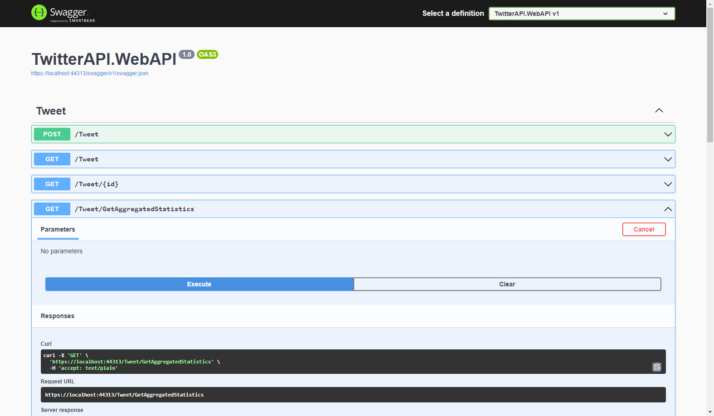

# TwitterAPI

This TwitterAPI solution for self-education/training is a Proof of Concept of how to combine different .NET technologies (Azure, .NET 6, Worker Service, API, Event Bus, Web App, SQL Database...) for processing transactions concurrently within a high-volume transaction environment.

It is also meant to illustrate how to follow good development patterns such as:
* SOLID
  * Single-Responsibility Principle
  * Open-Closed Principle
  * Liskov Substitution Principle
  * Interface Segregation Principle
  * Dependency Inversion Principle
* Use of patterns that could scale applications and are loosely coupled to external systems
* Good use of error handling, logging, and unit testing

The solution uses the Twitter API which provides a sampled stream endpoint that delivers a roughly 1% random sample of publicly available Tweets in real-time.
The Twitter API v2 sampled stream endpoint provides a random sample of approximately 1% of the full tweet stream that can be used for social sentiment analysis.

This solution consumes the sample stream and keep track of the following:  
• Total number of tweets received  
• Top 10 Hashtags 


#### High-Level Architecture diagram for the solution.


## Requirements
* You will need a Twitter Developer Account
* Within your Twitter Developer Account you need to create a Project with an Application inside


* Copy API Key and API Secret


* Replace the values on the appsettings.json of the downloaded project **TwitterAPI.DataPullingService**
```
  "TwitterAPISettings": {
    "ApiKey": "B0Pkt9jYspkK6sM54QNaUyLjv",
    "ApiSecretKey": "8kZu9rEkRx8K3ajwlvyAX1YicEbYbL3Rl1ekw8dvNijSv3CcK1"
  }
```

* Run with multiple startup projects:
* 
* **TwitterAPI.DataPullingService**
* 
* 
* **TwitterAPI.WebAPI**
* 

* **TwitterAPI.WebApp**
* 
* 

* Use **TwitterAPI.WebApp** or the api endpoint **Tweet/GetAggregatedStatistics** from **TwitterAPI.WebAPI** project to calculate, retrieve and view the Aggregated Statistics
```
curl -X 'GET' \
  'https://localhost:44313/Tweet/GetAggregatedStatistics' \
  -H 'accept: text/plain'
```  
It will return the following Json object.
Data collected up to: 10/20/2022 12:11am ET
```
{
  "id": 22,
  "aggregationGuid": "e3ec6f1e-4e22-4d11-9021-3fe5adb1c647",
  "numberOfTweets": 273854,
  "upToDate": "2022-10-20T04:06:51.3766667+00:00",
  "top10Hashtags": [
    {
      "id": 201,
      "hashtag": "#مهسا_امینی",
      "hashtagCount": 16490,
      "tweetAggregatedStatisticId": 22
    },
    {
      "id": 202,
      "hashtag": "#çerkezköy",
      "hashtagCount": 10862,
      "tweetAggregatedStatisticId": 22
    },
    {
      "id": 203,
      "hashtag": "#kapaklı",
      "hashtagCount": 9658,
      "tweetAggregatedStatisticId": 22
    },
    {
      "id": 204,
      "hashtag": "#buca",
      "hashtagCount": 5937,
      "tweetAggregatedStatisticId": 22
    },
    {
      "id": 205,
      "hashtag": "#지구에서년지성아환영해",
      "hashtagCount": 5548,
      "tweetAggregatedStatisticId": 22
    },
    {
      "id": 206,
      "hashtag": "#bornova",
      "hashtagCount": 5053,
      "tweetAggregatedStatisticId": 22
    },
    {
      "id": 207,
      "hashtag": "#نیکا_شاکرمی",
      "hashtagCount": 4653,
      "tweetAggregatedStatisticId": 22
    },
    {
      "id": 208,
      "hashtag": "#karşıyaka",
      "hashtagCount": 4636,
      "tweetAggregatedStatisticId": 22
    },
    {
      "id": 209,
      "hashtag": "#alsancak",
      "hashtagCount": 3888,
      "tweetAggregatedStatisticId": 22
    },
    {
      "id": 210,
      "hashtag": "#cigli",
      "hashtagCount": 3777,
      "tweetAggregatedStatisticId": 22
    }
  ],
  "data": [
    16490,
    10862,
    9658,
    5937,
    5548,
    5053,
    4653,
    4636,
    3888,
    3777
  ],
  "labels": [
    "#مهسا_امینی",
    "#çerkezköy",
    "#kapaklı",
    "#buca",
    "#지구에서년지성아환영해",
    "#bornova",
    "#نیکا_شاکرمی",
    "#karşıyaka",
    "#alsancak",
    "#cigli"
  ]
}
```

## New Features Added 10/06/2022
* Save tweets in database via existing API until Processing Queue is implemented
* Refator databases Tweet Model to support multiple hashtags
* Modify data aggregation scripts to work with multiple hashtags per tweet

## New Features Added 10/20/2022
* Pull aggregated data and display it on TwitterAPI.WebApp
* Implement Aggregated Tweets Data Dashboard using Mudblazor
* Implement Tweet List using Blazor

## Upcoming Features
* Automatically push data into the TwitterAPI.WebApp using SignalR
* Create Processing Queue using Azure Service Bus
* Implement Azure Key Vault for storing Twitter API Keys
* Implement CRUD UI using Blazor to feed data store with manual Tweets


